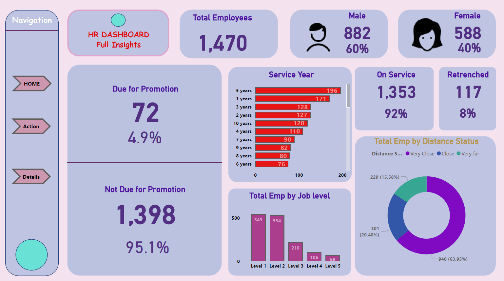

# 📊 HR Analytics Dashboard – Power BI Project

## 📌 Overview
This Power BI dashboard provides insightful HR analytics to help organizations monitor employee attrition, performance, and diversity across departments and roles. It empowers HR managers to make data-driven decisions.

---

## 🧠 Problem Statement
Organizations often struggle to identify key reasons behind employee attrition and engagement levels. This dashboard helps HR teams monitor patterns and take preventive actions using visual analysis.

---

## 🔄 Data Source
- Sample HR data from Kaggle / provided during training
- Contains fields like age, job role, department, attrition status, education, monthly income, etc.

---

## 🔍 Features

- 📉 **Attrition Analysis** – By department, gender, education
- 🏢 **Department Distribution** – Visual breakdown of employees per department
- 💼 **Job Role vs. Income** – Comparison of monthly income across roles
- 📊 **Interactive Filters** – Gender, Education Field, Job Role

---

## 🛠️ Tools Used

- Power BI Desktop
- Power Query for transformation
- DAX (Data Analysis Expressions)

---

## 📷 Dashboard Preview

---

## 📁 Download File

- [📥 HR_Analytics_Dashboard.pbix](https://github.com/Sanjayr1904/hr-analytics-dashboard/raw/main/HR_Analytics_Dashboard.pbix)

---

## 📚 Learnings

- Built dynamic visuals using DAX measures
- Practiced Power Query transformation logic
- Learned how to tell a story with interactive visuals
